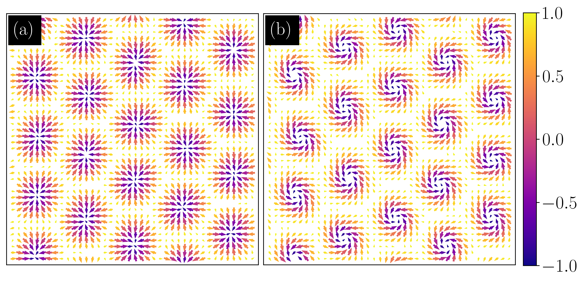

# Monte Carlo Simulation for Rashba Spin-Orbit Coupled Systems

Monte Carlo simulation for studying twisted magnetic skyrmions.

## Key Parameters

Edit in `input_parameters.py`:

- `nx`, `ny` - Lattice size (default: 40x40)
- `Neq`, `Nav` - MC steps for equilibration and averaging
- `alpha` - Rashba coupling parameter
- `min_temp`, `max_temp` - Temperature range
- `B_zmn_min`, `B_zmn_max` - Applied magnetic field range

## Output

Creates `Bzmn_X.XXXXX/` folders with:
- `mag_vs_T.txt`, `energy_vs_T.txt`, etc. - Observables vs temperature
- `XXX.dat` files - Spin configurations and structure factors

## Results

<!--   -->

Skyrmion lattice at low temperature. Arrows show in-plane spins, colors show out-of-plane component.

## Speed

Code uses Numba JIT compilation for 20-100x speedup. First run compiles functions (~30 sec), then runs fast.

## Files

- `input_parameters.py` - All parameters
- `main_simulation.py` - Main program
- `monte_carlo.py` - MC algorithm
- `energy_functions.py` - Hamiltonian Energy calculations
- `observables.py` - Observable calculations
- `file_io_functions.py` - File operations
- `plot_lowest_temperature.py` - Plotting Spin configuration and structure factor
